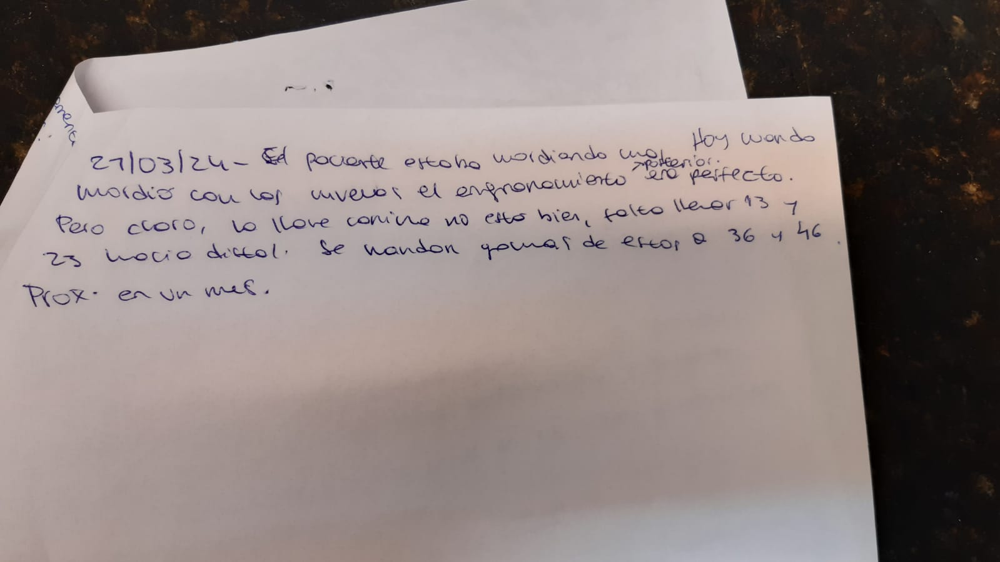

# seshat

## About

Streamlit interface to work with OCR tools.

## Backstory

So couple days ago I went to the dentist. I was curious about how she was
recording progress of the braces procedure, so I requested her some pictures.

The pictures looked something like this:



This doesn't look good at all, how do you even compare cases?
Can other people even understand what is written there? :smile:

There must be a better way! :relaxed:

## Usage

To start the web app:

```sh
streamlit run src/seshat/app.py
```

## Roadmap

- [x] Initial setup
    - [x] Create a "hello world" streamlit app
    - [ ] Add a command to start the app
- [x] Explorer
    - [x] Images in a folder
- [ ] Processing
    - [ ] Text detectors
        - [ ] Call an external text detector tool
        - [ ] Segment an image (extract cropings)
- [ ] Cleaning
    - [ ] Add class to image
- [ ] What next?

See the [open issues][open-issues] for a full list of
proposed features (and known issues).

## Contributing

Contributions are what make the open source community such an amazing place
to learn, inspire, and create.
Any contributions you make are greatly appreciated.

If you have a suggestion that would make this better, please fork
the reposiotry and create a pull request. You can also simply open
an issue with the tag "enhancement".

Things to keep in mind:

- We use pre-commit, so don't forget to run `pre-commit install`

[open-issues]: https://github.com/othneildrew/Best-README-Template/issues
